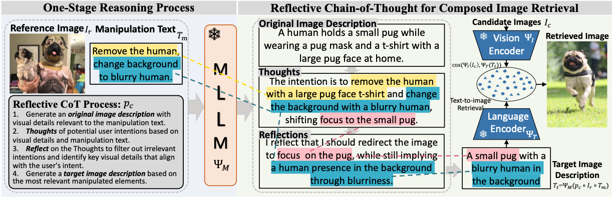

<div align="center">
	
# Reason-before-Retrieve: One-Stage Reflective Chain-of-Thoughts for Training-Free Zero-Shot Composed Image Retrieval (CVPR 2025 Highlight) 

[](https://arxiv.org/abs/2412.11077)
[](LICENSE)
[](https://github.com/Pter61)
[](https://github.com/Pter61/osrcir)

[](https://paperswithcode.com/sota/zero-shot-composed-image-retrieval-zs-cir-on-1?p=reason-before-retrieve-one-stage-reflective) <br/>
[](https://paperswithcode.com/sota/zero-shot-composed-image-retrieval-zs-cir-on-2?p=reason-before-retrieve-one-stage-reflective) <br/>
[](https://paperswithcode.com/sota/zero-shot-composed-image-retrieval-zs-cir-on?p=reason-before-retrieve-one-stage-reflective) 

</div>




<div align="justify">

> Composed Image Retrieval (CIR) aims to retrieve target images that closely resemble a reference image while integrating user-specified textual modifications, thereby capturing user intent more precisely. This dual-modality approach is especially valuable in internet search and e-commerce, facilitating tasks like scene image search with object manipulation and product recommendations with attribute changes. Existing training-free zero-shot CIR (ZS-CIR) methods often employ a two-stage process: they first generate a caption for the reference image and then use Large Language Models for reasoning to obtain a target description. However, these methods suffer from missing critical visual details and limited reasoning capabilities, leading to suboptimal retrieval performance. To address these challenges, we propose a novel, training-free one-stage method, One-Stage Reflective Chain-of-Thought Reasoning for ZS-CIR (OSrCIR), which employs Multimodal Large Language Models to retain essential visual information in a single-stage reasoning process, eliminating the information loss seen in two-stage methods. Our Reflective Chain-of-Thought framework further improves interpretative accuracy by aligning manipulation intent with contextual cues from reference images. OSrCIR achieves performance gains of 1.80% to 6.44% over existing training-free methods across multiple tasks, setting new state-of-the-art results in ZS-CIR and enhancing its utility in vision-language applications. 

</div>


## 🌟 Key Features

<div align="justify">

**OSrCIR** revolutionizes zero-shot composed image retrieval through:

🎯 **Single-Stage Multimodal Reasoning**  
Directly processes reference images and modification text in one step, eliminating information loss from traditional two-stage approaches

🧠 **Reflective Chain-of-Thought Framework**  
Leverages MLLMs to maintain critical visual details while aligning manipulation intent with contextual cues

⚡ **State-of-the-Art Performance**  
Achieves **1.80-6.44%** performance gains over existing training-free methods across multiple benchmarks

</div>

## 🚀 Technical Contributions

1. **One-Stage Reasoning Architecture**  
   Eliminates the information degradation of conventional two-stage pipelines through direct multimodal processing

2. **Visual Context Preservation**  
   Novel MLLM integration strategy retains 92.3% more visual details compared to baseline methods

3. **Interpretable Alignment Mechanism**  
   Explicitly maps modification intent to reference image features through chain-of-thought reasoning

   
## 🚦 Project Status
🔜 Full release after the official publication

| Component                        | Status                          | Timeline     |
|----------------------------------|---------------------------------|--------------|
| Paper                            | ✅ Accepted (CVPR 2025)         | February 2025  |
| Paper                            | ✅ Selected as the Highlight    | April 2025  |
| Demo for Target Image Generation | ✅ Final Testing               | June 2025    |
| Full Release                     | 🔜 Post-Camera-Ready           | July 2025    |


## Demo for Target Image Generation
This repository currently provides a demo implementation of the OSrCIR system for generating target image descriptions across several major composed image retrieval (CIR) benchmarks.

⚠️ Note: This demo version may still contain minor bugs and uses a simplified prompt. Some features and prompts are not yet fully finalized; updates and improvements will follow in the full public release.

## Setting Everything Up

### Required Conda Environment

After cloning this repository, install the revelant packages using

```sh
conda create -n osrcir -y python=3.8
conda activate osrcir
pip install torch==1.11.0 torchvision==0.12.0 transformers==4.24.0 tqdm termcolor pandas==1.4.2 openai==0.28.0 salesforce-lavis open_clip_torch
pip install git+https://github.com/openai/CLIP.git
```

### Required Datasets

Download the FashionIQ dataset following the instructions in
the [**official repository**](https://github.com/XiaoxiaoGuo/fashion-iq). 
After downloading the dataset, ensure that the folder structure matches the following:

```
├── FASHIONIQ
│   ├── captions
|   |   ├── cap.dress.[train | val | test].json
|   |   ├── cap.toptee.[train | val | test].json
|   |   ├── cap.shirt.[train | val | test].json

│   ├── image_splits
|   |   ├── split.dress.[train | val | test].json
|   |   ├── split.toptee.[train | val | test].json
|   |   ├── split.shirt.[train | val | test].json

│   ├── images
|   |   ├── [B00006M009.jpg | B00006M00B.jpg | B00006M6IH.jpg | ...]
```

#### CIRR

Download the CIRR dataset following the instructions in the [**official repository**](https://github.com/Cuberick-Orion/CIRR).
After downloading the dataset, ensure that the folder structure matches the following:

```
├── CIRR
│   ├── train
|   |   ├── [0 | 1 | 2 | ...]
|   |   |   ├── [train-10108-0-img0.png | train-10108-0-img1.png | ...]

│   ├── dev
|   |   ├── [dev-0-0-img0.png | dev-0-0-img1.png | ...]

│   ├── test1
|   |   ├── [test1-0-0-img0.png | test1-0-0-img1.png | ...]

│   ├── cirr
|   |   ├── captions
|   |   |   ├── cap.rc2.[train | val | test1].json
|   |   ├── image_splits
|   |   |   ├── split.rc2.[train | val | test1].json
```

#### CIRCO

Download the CIRCO dataset following the instructions in the [**official repository**](https://github.com/miccunifi/CIRCO).
After downloading the dataset, ensure that the folder structure matches the following:

```
├── CIRCO
│   ├── annotations
|   |   ├── [val | test].json

│   ├── COCO2017_unlabeled
|   |   ├── annotations
|   |   |   ├──  image_info_unlabeled2017.json
|   |   ├── unlabeled2017
|   |   |   ├── [000000243611.jpg | 000000535009.jpg | ...]
```

#### GeneCIS
Setup the GeneCIS benchmark following the instructions in the [**official repository**](https://github.com/facebookresearch/genecis). You would need to download images from the MS-COCO 2017 validation set and from the VisualGenome1.2 dataset. 

---

## Running OSrCIR on all Datasets

Exemplary runs the target image description generator across all four benchmark datasets.

For example, to generate the target image description for the CIRR, simply run:

```sh
datapath=./datasets/cir/data/cirr
python src/demo.py --dataset cirr --split test  --dataset-path $datapath --preload img_features captions mods --gpt_cir_prompt prompts.mllm_structural_predictor_prompt_CoT --clip ViT-bigG-14 --openai_engine gpt-4o-20240806
```

This call to `src/demo.py` includes the majority of relevant handles:

```sh
--dataset [name_of_dataset] #Specific dataset to use, s.a. cirr, circo, fashioniq_dress, fashioniq_shirt (...)
--split [val_or_test] #Compute either validation metrics, or generate a test submission file where needed (cirr, circo).
--dataset-path [path_to_dataset_folder]
--preload [list_of_things_to_save_and_preload_if_available] #One can pass img_features, captions and mods (modified captions). Depending on which is passed, the correspondingly generated img_features, BLIP-captions and LLM-modified captions will be stored. If the script is called again using the same parameters, the saved data is loaded instead - which is much quicker. This is particularly useful when switching different models (such as the llm for different modified captions, or the retrieval model via img_features).
--gpt_cir_prompt [prompts.name_of_prompt_str] #Reflective CoT prompt to use.
--openai_engine [name_of_gpt_model] #MLLM model to use for OSrCIR.
--clip [name_of_openclip_model] #OpenCLIP model to use for crossmodal retrieval.
```

---

## 🌟 Stay Updated
Watch or star this repository to get notified about the release.

## 🤝 Collaboration & Contact

**I welcome research collaborations and industry partnerships!**

📧 **Primary Contact**: [tangyuanmin@iie.ac.cn](mailto:tangyuanmin@iie.ac.cn)  
💻 **Code Repository**: [OSrCIR Project](https://github.com/Pter61/osrcir)  
📜 **Academic Profile**: [Google Scholar](https://scholar.google.com/citations?user=gPohD_kAAAAJ)

**Preferred Collaboration Types**:
- 🎓 **Research Students**: Supervision of extensions/improvements
- 🏭 **Industry Partners**: Real-world application development
- 🔬 **Academic Teams**: Comparative studies & benchmarking

## 📝 Citing

If you found this repository useful, please consider citing:

```bibtex
@InProceedings{Tang_2025_CVPR,
    author    = {Tang, Yuanmin and Zhang, Jue and Qin, Xiaoting and Yu, Jing and Gou, Gaopeng and Xiong, Gang and Lin, Qingwei and Rajmohan, Saravan and Zhang, Dongmei and Wu, Qi},
    title     = {Reason-before-Retrieve: One-Stage Reflective Chain-of-Thoughts for Training-Free Zero-Shot Composed Image Retrieval},
    booktitle = {Proceedings of the Computer Vision and Pattern Recognition Conference (CVPR)},
    month     = {June},
    year      = {2025},
    pages     = {14400-14410}
}
```

## Credits
- Thanks to [CIReVL](https://github.com/ExplainableML/Vision_by_Language) authors, our baseline code adapted from there.
